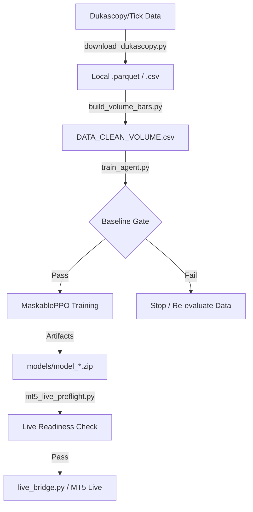

# Repository Map & Architecture Guide

This document provides a high-level overview of the **Turbo Forex RL Pipeline**. It is designed to help future agents (and humans) understand the repository structure, data flow, and key components without needing to re-analyze every file.

---

## 🏗️ High-Level Architecture

The system follows a linear pipeline from raw tick data to a live trading agent:



---

## 📂 File Tree (Cleaned)

```text
trading/
├── legacy/                  # Archived scripts and research artifacts
├── tools/                   # Operational utilities (monitor, healthcheck, etc.)
├── data/                    # Raw and processed datasets (ignored in Git)
├── models/                  # Trained agents, scalers, and manifests
│   ├── archive/             # Old run artifacts versioned by timestamp
│   └── baseline_*.json      # Results from Ridge/Tree baseline gates
├── docs/                    # Detailed guides and developer context
│   └── agent_md_pack/       # [NEW] AI reasoning and decision policies
├── tests/                   # Regression suite (Unit/Smoke tests)
├── checkpoints/             # Intermediate training heartbeats and stats
├── tensorboard_log/         # PPO training metrics for visualization
│
├── train_agent.py           # [MAIN] Phase 11+ Training (MaskablePPO)
├── trading_env.py           # Legacy core (Fallback for old models)
├── runtime_gym_env.py       # Performance-optimized "Production" environment
├── feature_engine.py        # 8-signal engineered feature pipeline
├── trading_config.py        # Shared hyperparameters and deployment gates
│
├── download_dukascopy.py    # Tick data ingestion (Turbo-optimized)
├── build_volume_bars.py     # Unified volume bar construction (2000-tick default)
│
├── evaluate_oos.py          # Out-of-sample validation and performance audits
├── live_bridge.py           # MT5 Execution Bridge (Event-driven)
├── main_turbo_pipeline.py   # Orchestration: Download -> Build -> Train -> Eval
└── start_training_bg.ps1    # PowerShell launcher for background runs
```

---

## 🛡️ Functional Categories

### 1. Data Layer
| File | Role |
| :--- | :--- |
| `download_dukascopy.py` | Primary ingestion from Dukascopy. Supports multi-threading. |
| `build_volume_bars.py` | Consolidates multiple symbols into `DATA_CLEAN_VOLUME.csv`. |
| `symbol_utils.py` | Constant definitions for pip sizes, values, and contract specs. |
| `legacy/` | Contains abandoned scripts (download_yahoo, merge_mega, etc.) |

### 2. Operational Tools
| File | Role |
| :--- | :--- |
| `tools/monitor_training.ps1` | Calculates rolling throughput and ETA from heartbeats. |
| `tools/watch_training.ps1` | Live console dashboard for active training runs. |
| `tools/project_healthcheck.py`| Validates .venv, dependencies, and core artifacts. |
| `tools/training_status.py` | Low-level JSON diagnostics for PPO stability. |
| `tools/summarize_execution_audit.py` | Analyzes live trading slippage and drift. |
| `tools/restart_drill.py` | Utility to force-restart and validate pipeline recovery. |

### 3. Training & AI Logic
| File | Role |
| :--- | :--- |
| `train_agent.py` | **The Master Script.** Handles curriculum learning, purged folds, and baseline gates. |
| `main_turbo_pipeline.py` | An orchestration script that runs Download -> Build -> Train -> Eval. |
| `start_training_bg.ps1` | Best way to launch training. Redirects output to `train_run.log`. |
| `trading_config.py` | Global constants for SL/TP multipliers and deployment thresholds. |

### 4. Evaluation & Compliance
| File | Role |
| :--- | :--- |
| `evaluate_oos.py` | Runs a trained agent on "Wait-and-See" data to verify profitability. |
| `validation_metrics.py` | Core library for calculating Sharpe, Sortino, and Max Drawdown. |
| `summarize_execution_audit.py` | Compares live fills vs. expected prices to detect slippage drift. |

### 5. Live & Execution
| File | Role |
| :--- | :--- |
| `live_bridge.py` | The production bot. Listens to MT5 events and sends orders. |
| `mt5_live_preflight.py` | **MANDATORY** check before live trading to ensure all artifacts match. |
| `live_operating_checklist.py` | Scripted sanity checks for active live sessions. |

### 6. Infrastructure & Tooling
| File | Role |
| :--- | :--- |
| `interpreter_guard.py` | Prevents "Dependency Hell" by auto-correcting the Python interpreter. |
| `project_healthcheck.py` | Quickly checks if CUDA, `.venv`, and data paths are healthy. |
| `device_utils.py` | Detects hardware (CPU/GPU) and configures PyTorch/PPO for max speed. |
| `artifact_manifest.py` | Tracks which model uses which scaler to prevent feature mismatch. |

---

## 🚀 Quick Onboarding for Future Agents

1.  **Check Health**: Run `python project_healthcheck.py`.
2.  **Verify Data**: Check `data/DATA_CLEAN_VOLUME.csv`. Is it recent? Does it have the right symbols?
3.  **Monitor Training**:
    *   `Get-Content train_run.log -Tail 50` for logs.
    *   `python training_status.py --symbol EURUSD` for PPO diagnostics.
4.  **Edit cautiously**:
    *   If changing features, update `feature_engine.py` **AND** clear existing scalers in `models/`.
    *   All training entrypoints *must* call `ensure_project_venv`.

---

> [!TIP]
> **Priority One**: Maintain "Engineering Truthfulness". If the runtime and the training environment diverge by even one pip, the model is invalid. Always check `mt5_live_preflight.py` results.
