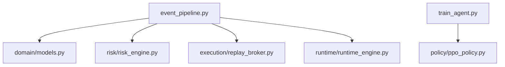

# Turbo North Star Architecture Audit

This document audits the current "Turbo" codebase against professional algorithmic trading standards (the "North Star"). It identifies where the system excels and where architectural hardening is required to reach production-grade reliability.

## Audit Table

| Area | Requirement | Current Turbo Component | Status | Gap | Action |
| :--- | :--- | :--- | :--- | :--- | :--- |
| **Architektúra** | Modular split (data, risk, exec) | `event_pipeline.py` / `train_agent.py` | **Partial** | `event_pipeline.py` is a "God File" combining Risk, Exec, and Runtime. | Split `event_pipeline.py` into `domain/`, `risk/`, and `execution/`. |
| **Data** | Data versioning & validation | `dataset_builder.py` / `dataset_validation.py` | **Done** | Integrity checks exist but formal versioning is manual. | Integrate version hashing into `artifact_manifest.py`. |
| **Features** | Deterministic Feature Schema | `feature_engine.py` | **Done** | Schema is fixed but not formally declared as a separate validation artifact. | Create `features/feature_schema.py` for inference-time validation. |
| **Policy** | Action/Signal purity | `train_agent.py` (PPO) | **Done** | Training logic is clean, but environment interaction is tightly coupled to Gym. | Ensure `PolicyAdapter` can run outside of Gym for live bridge. |
| **Risk** | Pre-order safety gates | `RiskEngine` | **Done** | Logic exists (DD, Daily Loss) but is bound to `RuntimeEngine`. | Extract `RiskEngine` to a standalone `risk/risk_engine.py`. |
| **Execution** | Realistic Cost Modeling | `ReplayBroker` | **Done** | Spread, Fee, and Slippage (Curriculum) are highly realistic. | None. |
| **Live-Readiness** | Preflight, Heartbeat, Kill-Switch | `mt5_live_preflight.py` | **Partial** | Preflight exists; Heartbeat and Kill-Switch are missing or manual. | Implement `ops/heartbeat.py` and `ops/kill_switch.py`. |
| **Reliability** | Multiprocessing Safety (Pickle) | `device_utils.py` / `SubprocVecEnv` | **Done** | Recently hardened for Windows and Parallel workers. | None. |
| **Code Quality** | No God Files / Clean Config | `event_pipeline.py` | **Missing** | `event_pipeline.py` is >1400 lines and covers too many domains. | Refactor and modularize core engines. |
| **Artifacts** | Model Manifests & Schema check | `artifact_manifest.py` | **Partial** | Manifest exists but lacking feature schema/scaler compatibility contract. | Enhance `artifact_manifest.py` to include `feature_schema`. |

---

## Detailed Gap Analysis

### 1. The "God File" Problem (`event_pipeline.py`)
> [!WARNING]
> `event_pipeline.py` currently manages: Tick-to-Bar building, Account State, Order Processing, Fill Logic, Slippage, and the main Runtime loop. This makes it difficult to unit-test `Risk` independently of `Execution`.
> **Action**: Split into `execution/replay_broker.py`, `risk/risk_engine.py`, and `runtime/runtime_engine.py`.

### 2. Live-Readiness & Orchestration
> [!IMPORTANT]
> While we have a `LiveBridge` concept, the "Kill Switch" and "Reconciliation" (checking if Internal State matches Broker State) are not formally implemented as automated daily routines.
> **Action**: Create `ops/` directory for automated health checks and reconciliation audits.

### 3. Formal Artifact Contracts
> [!TIP]
> To prevent "Inference Drift" (running a model with the wrong features), every saved model should carry a `manifest.json` that the `Inference` layer *must* validate before starting.
> **Action**: Hardlink `FeatureEngine` schema version to the model metadata.

## Refactor Roadmap (Phase 2)

## Next Step
- Start the modular extraction of **Risk** and **Execution** from the "God File".
